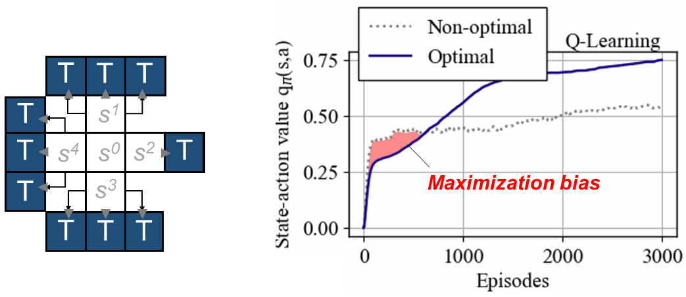
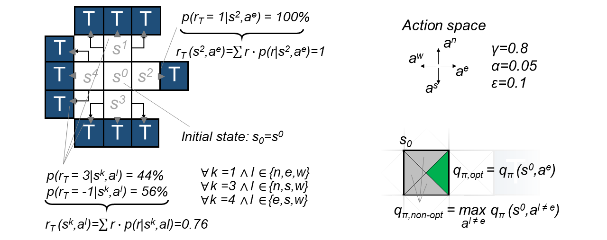

# RL_Grid

The **RL_Grid** project provides a grid world environment for analyzing maximization bias/ overestimation bias in Reinforcement Learning (RL). A common antidote to maximization bias is Double-Q-Learning. The present code includes Q-Learning and Double-Q-Learning in order to demonstrate the beneficial effect of learning multiple Q-functions. The grid world example 



*Figure 1: The 2D grid world (left) and the learning curve of Q-Learning with the maximization bias of the non-optimal actions at the beginning of RL training.*

---

## Table of Contents

1. [Overview](#overview)
2. [Project structure](#project-structure)
3. [Installation and Usage](#installation-and-usage)
4. [License](#license)
5. [Citing](#citing)
6. [References](#references)
7. [Acknowledgments](#acknowledgments)

---


## Overview
**RL_Grid** is written in Python and includes a simple grid world environment and two common RL algorithms. This section details the setup and the issue of maximization bias.

### Maximization bias/ Overestimation bias
Maximization bias is a common issue in RL which can slow down learning considerably. It originates from taking the maximum of a noisy value estimate [1]. For example, the bias may arise by the *argmax* operator in (ε-)greedy action selection and/or the *max* in Q-Learning updates [2]. These maximization operators tend to introduce a significant positive bias in the state-action value q<sub>π</sub>, which can deteriorate the agent performance [3]. --REPHRASE--

### Grid world
To investigate maximization bias, **RL_Grid** applies a simple 2D grid world environment (Fig. 2) with four different states S $\in$ {s<sup>0</sup>, s<sup>1</sup>, s<sup>2</sup>, s<sup>3</sup>}, resembling the finite MDP environment of Sutton and Barto [2] (Fig. 6.5, p. 135). The agent is always initialized in s<sup>0</sup> and can take an action according to its action space A $\in$ {a<sup>n</sup>, a<sup>e</sup>, a<sup>s</sup>, a<sup>w</sup>}. When the agent enters one of the terminal states T, it receives a reward according to the underlying reward model.



*Figure 2: 2D grid world with the optimal path (s<sup>0</sup>, a<sup>e</sup>, s<sup>2</sup>, a<sup>e</sup>, T) [T: Terminal state; p(r|s,a): Probability of the reward r for taking action a in state s; q<sub>π,opt</sub>: State-action value of the optimal path in s<sup>0</sup>; q<sub>π,non-opt</sub>: Maximum state-action value of the non-optimal path in s<sup>0</sup>; α: Learning rate; γ; Discount factor; ε: Exploration coefficient].*

Due to the reward model, the optimal path with the highest expected reward of 1 is (s<sup>0</sup>, a<sup>e</sup>, s<sup>2</sup>, a<sup>e</sup>, T). By contrast, the expected reward for entering T being in s<sup>1</sup>, s<sup>3</sup>, or s<sup>4</sup> only offers 0.76. However, the agent may encounter a reward of 3 with 44 % probability, which can lead to an overestimation of state-action values at the beginning of training. 

### Q-Learning and Double Q-Learning
Q-Learning is a fundamental value-based, off-policy RL algorithm with a temporal difference (TD) update of the state-action value. These q<sub>π</sub> values support the agent in taking a good action in the environment. Typically, the action selection involves an ε-greedy policy. , it decides on taking . For more information, please refer to [2].

## Project Structure

The project is organized into the following directories and files:

```plaintext
RL_Grid
├── config
│   └── config.py
│
├── src
│   ├── rl_grid_agents.py
│   ├── rl_grid_config.py
│   ├── rl_grid_env.py
│   └── rl_grid_utils.py
│
├── requirements.txt
└── rl_grid_main.py

```

### `config/config.yaml` 
Contains configuration file for the project.  

### `src/`
Contains source code for RL agents and the environment:  
- **`src/rl_config_train.py`**: Preprocesses training settings.
  - `TrainConfiguration()`: Training class.
- **`data/OP.../data-meth_cooldown.csv`**: Cold startup data.

## Installation and Usage
To set up the project, clone the repository and install the required dependencies. You can do this by running:

```bash
pip install -r requirements.txt
```

## Usage
To run the project, execute the `main.py` file:

```bash
python src/main.py
```

This will initialize the grid world environment, create the reinforcement learning agents, and start the training process. After training, the results will be plotted automatically.

## Components

### Environment
- **GridWorldEnv**: This class implements the grid world environment. It includes methods for:
  - Initializing the environment
  - Stepping through actions
  - Resetting the environment
  - Checking if an episode is done

### Agents
- **QAgent**: Implements the Q-learning algorithm.
- **DoubleQAgent**: Implements the Double Q-learning algorithm.

Both agents have methods for:
- Taking actions
- Updating policies
- Performing Q-learning updates

### Utilities
- **Plotting Functions**: Utility functions for visualizing results, including efficiency plots and reward histories.

## References

[1] S. Thrun, A. Schwartz, "*Issues in using function approximation for reinforcement learning*", Proceedings of the 1993 connectionist models summer school, 1993, 255–263

[2] R. S. Sutton, A. G. Barto, "*Reinforcement Learning: An Introduction*", The MIT Press, Cambridge, Massachusetts, 2018

[3] H. V. Hasselt, "*Double Q-learning*", Advances in neural information processing systems, 23, 2010, 1–9

## Requirements
The project requires the following Python packages:
- numpy
- matplotlib
- tqdm

Make sure to install these packages using the `requirements.txt` file.

## License
This project is licensed under the MIT License. See the LICENSE file for more details.