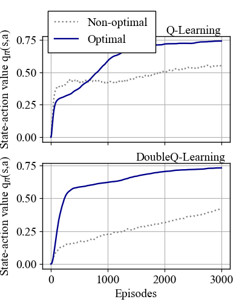

# RL_Grid

The **RL_Grid** project provides a grid world environment for analyzing maximization bias (also known as overestimation bias) in Reinforcement Learning (RL). A common solution to address maximization bias is Double-Q-Learning. This project includes implementations of both Q-Learning and Double-Q-Learning to demonstrate the advantages of learning multiple Q-functions. 


*Figure 1: The 2D grid world (left) and the learning curve of Q-Learning showing the maximization bias of non-optimal actions at the beginning of RL training (right).*

---

## Table of Contents

1. [Overview](#overview)
2. [Project structure](#project-structure)
3. [Installation and Usage](#installation-and-usage)
4. [License](#license)
5. [Citing](#citing)
6. [References](#references)
7. [Acknowledgments](#acknowledgments)

---


## Overview

**RL_Grid** is written in Python and includes a simple grid world environment along with two common RL algorithms. This section explains the setup and the issue of maximization bias.

### Maximization bias/ Overestimation bias

Maximization bias is a common issue in RL that can significantly slow down learning. It arises from taking the maximum of a noisy value estimate [1]. For example, this bias can occur due to the *argmax* operator in (ε-)greedy action selection and/or the *max* operator in Q-Learning updates [2]. These maximization operations can introduce a significant positive bias in the state-action value q<sub>π</sub>, which can reduce the agent's performance [3].

### Grid world

To investigate maximization bias, **RL_Grid** uses a simple 2D grid world environment (Fig. 2) with four states S $\in$ {s<sup>0</sup>, s<sup>1</sup>, s<sup>2</sup>, s<sup>3</sup>}, resembling the finite MDP environment described by Sutton and Barto [2] (Fig. 6.5, p. 135). The agent always starts in s<sup>0</sup> and can take actions from its action space A $\in$ {a<sup>n</sup>, a<sup>e</sup>, a<sup>s</sup>, a<sup>w</sup>}. When the agent reaches one of the terminal states T, it receives a reward based on the underlying reward model.


*Figure 2: 2D grid world with the optimal path (s<sup>0</sup>, a<sup>e</sup>, s<sup>2</sup>, a<sup>e</sup>, T). [T: Terminal state; p(r|s,a): Probability of the reward r for taking action a in state s; q<sub>π,opt</sub>: State-action value of the optimal action in s<sup>0</sup>; q<sub>π,non-opt</sub>: Maximum state-action value of the non-optimal action in s<sup>0</sup>; α: Learning rate; γ: Discount factor; ε: Exploration coefficient].*

The reward model results in the optimal path (s<sup>0</sup>, a<sup>e</sup>, s<sup>2</sup>, a<sup>e</sup>, T) with the highest expected reward of 1 at the terminal state. In contrast, entering T from states s<sup>1</sup>, s<sup>3</sup>, or s<sup>4</sup> offers an expected reward of only 0.76. However, the agent may occasionally encounter a reward of 3 with a 44% probability, which can lead to an overestimation of state-action values early in training.

### Q-Learning and Double Q-Learning

**Note**: *This subsection provides a brief overview of the Q-Learning and Double Q-Learning algorithms. For more details, please refer to [2].*

Q-Learning is a fundamental value-based, off-policy RL algorithm that uses a temporal difference (TD) update to estimate state-action values (q<sub>π</sub>). These values guide the agent in selecting beneficial actions in the environment. The agent typically chooses the action with the highest q<sub>π</sub> (greedy policy). However, without exploration, the agent may fail to improve the q<sub>π</sub> estimates for other actions, potentially leading to a suboptimal policy. To address this, an ε-greedy policy is often used, where the agent selects a random action with probability ε, ensuring sufficient exploration.

After the agent takes an action a in state s, it observes the reward r and the next state s'. Based on this information, the Q-Learning update rule is as follows:

> q<sub>π</sub>(s,a) <- q<sub>π</sub>(s,a) + α ((r + γ max<sub>a'</sub> q<sub>π</sub>(s',a')) - q<sub>π</sub>(s,a))

Here, α is the learning rate, and γ is the discount factor. While Q-Learning is effective, its reliance on two *max* operators makes it susceptible to maximization bias.

To mitigate this issue, Hasselt [3] introduced Double Q-Learning, where the agent learns two separate Q-functions:

> q<sub>π,1</sub>(s,a) <- q<sub>π,1</sub>(s,a) + α ((r + γ q<sub>π,2</sub>(s',argmax<sub>a'</sub> q<sub>π,1</sub>(s',a'))) - q<sub>π,1</sub>(s,a))

> q<sub>π,2</sub>(s,a) <- q<sub>π,2</sub>(s,a) + α ((r + γ q<sub>π,1</sub>(s',argmax<sub>a'</sub> q<sub>π,2</sub>(s',a'))) - q<sub>π,2</sub>(s,a))

This approach reduces maximization bias by using one Q-function to estimate the future reward and the other to update the current state-action value. A potential maximization bias of one Q-function will therefore be tested by the other one in the update step.

## Project Structure

The project is organized into the following directories and files:

```plaintext
RL_Grid
├── config
│   └── config.py
│
├── src
│   ├── rl_grid_agents.py
│   ├── rl_grid_config.py
│   ├── rl_grid_env.py
│   └── rl_grid_utils.py
│
├── requirements.txt
└── rl_grid_main.py

```

### `config/config.yaml` 
Configuration file for the project. 

### `src/`
Contains source code for RL agents and the environment: 
- **`src/rl_grid_agents.py`**: Implements Q-Learning and Double Q-Learning algorithms.
  - `QAgent()`: Q-Learning class.
    - `update_policy()`: Updates the policy based on q<sub>π</sub>.
    - `q_learning_update()`: Updates q<sub>π</sub>(s,a) based on the Q-Learning update rule.
    - `take_action()`: Takes an action according to the current ε-greedy policy.
    - `reset()`: Resets the agent.  
  - `DoubleQAgent()`: Double Q-Learning class.
    - `update_policy()`: Updates the policy based on the q<sub>π</sub>.
    - `q_learning_update()`: Updates q<sub>π</sub>(s,a) based on the Double Q-Learning update rule.
    - `take_action()`: Takes an action according to the current ε-greedy policy.
    - `reset()`: Resets the agent.  
- **`src/rl_grid_config.py`**: Configuration class for RL_Grid.
- **`src/rl_grid_env.py`**: Defines the grid world environment.
  - `GridWorldEnv()`: Grid world environment class.
    - `_get_obs()`: Returns the current observation.
    - `_get_reward()`: Calculates the reward based on the current state and action.
    - `reset()`: Resets the environment.
    - `step()`: Executes an action in the environment.  
    - `_is_done()`: Checks whether the agent has reached a terminal state and the episode is complete.
- **`src/rl_grid_utils.py`**: Provides visualization utilities.
  - `plot_results()`: Generates a plot showing the Q-values averaged over all training runs.

### **Main Script**  
- **`rl_grid_main.py`** – Main script for training and evaluating the RL agents.  
  - `train_agent()` – Function for training a single agent in a separate process.  
  - `main()` – Runs model training and evaluation.  

### **Miscellaneous**  
- **`requirements.txt`** – Lists required Python libraries.


Note that the script runs the two different agents (Q-Learning and Double Q-Learning) in parallel to accelerate the training process. Although the environment itself is quite fast, training the agents for enough episodes (>1000) and a large number of training runs can take time. Since the reward model includes certain stochasticity, a sufficient number of independent training runs is required to reveal the agents' average learning performance. Parallel computing is implemented using multiprocessing.

---

## Installation and Usage

The project can be run in a virtual environment or a Docker container.

## Using a virtual environment
To run the project, follow these steps:

```bash
# Clone the repository
git clone https://github.com/SimMarkt/RL_Grid.git

# Navigate to the project directory
cd RL_Grid

# Create a Python virtual environment
python -m venv venv

# Activate the virtual environment
.\venv\Scripts\activate

# Install the required python libraries
pip install -r requirements.txt

# Run the project
python rl_grid_main.py

```

After setting up the Python environment and installing the necessary packages, you can adjust the environment, agent, and training configurations by modifying the YAML file in the `config/` directory. RL training is initiated by running the main script `rl_grid_main.py`. 

### Using a Docker container

To run **RL_PtG** in a Docker container, follow these steps to install and run the project:

```bash
# Clone the repository
git clone https://github.com/SimMarkt/RL_Grid.git

# Navigate to the project directory
cd RL_Grid

# Build the Docker container using the 'Dockerfile'
docker build -t rl-grid:v1 .

# Verify that the image was created successfully
docker images

>>
REPOSITORY    TAG       IMAGE ID       CREATED         SIZE
rl-grid       v1        ...            8 seconds ago   1.15GB
>>

# Run the container
docker run --rm -it rl-grid:v1

```

If you need to adjust the environment, agent, or training configurations, you can modify the YAML file located in the `config/` directory. After making these changes, rebuild the Docker image to apply them in the container (you can also optionally update the tag):

```bash
# Rebuild the Docker image using the 'Dockerfile'
docker build -t rl-grid:v1 .

# Verify that the image was created successfully
docker images

>>
REPOSITORY    TAG       IMAGE ID       CREATED         SIZE
rl-grid       v1        ...            2 minutes ago   1.15GB
>>

# Run the container
docker run --rm -it rl-grid:v1

```

Please note that training the RL agents can be resource-intensive, especially if you're performing extensive hyperparameter optimization or conducting in-depth analysis using multiple random seeds. In such cases, it's recommended to avoid using the Docker container and instead set up a Python virtual environment (as described above) for better performance.

### Evaluation

After training both agents, the code plots the results to `plots/Q-Learning_Gridworld_plot.png`. Fig. 3 illustrates the averaged results for 200 runs. As can be seen, Q-Learning suffers from considerable maximization bias at the beginning of training. The non-optimal actions (a<sup>n</sup>, a<sup>s</sup>, and a<sup>w</sup>) tend to entail a larger q<sub>π</sub> value, since the agent sometimes encounter the large positive reward of 3. However, in expectation, the reward is lower than with taking a<sup>e</sup>, which observered only after more than 600 episodes.

After training both agents, the code generates a plot saved as `plots/Q-Learning_Gridworld_plot.png`. Figure 3 illustrates the averaged results over 200 runs. As shown, Q-Learning suffers from significant maximization bias in early training. The non-optimal actions (a<sup>n</sup>, a<sup>s</sup>, and a<sup>w</sup>) tend to have larger q<sub>π</sub> values because the agent occasionally encounters a large positive reward of 3. However, on average, the reward is lower than that obtained by taking the optimal action a<sup>e</sup>, which becomes evident only after more than 600 episodes.




*Figure 3: State-action values for the optimal action (a<sup>e</sup>) in s<sup>0</sup> (q<sub>π,opt</sub>) and the maximum of the non-optimal actions (q<sub>π,non-opt</sub>) for Q-Learning and Double Q-Learning, averaged over 200 runs.*

In contrast, the Double Q-Learning algorithm almost immediately identifies the higher value of q<sub>π</sub>(s<sup>0</sup>, a<sup>e</sup>) and effectively avoids the overestimation of q<sub>π,non-opt</sub>.

---

## Requirements
- Required libraries:
  - `matplotlib`
  - `tqdm`
  - `numpy`
  - `pyyaml`

To avoid any version conflicts, it is recommended to use the libraries given in `requirements.txt`. 

---

## License

This project is licensed under [MIT License](LICENSE).

---

## Citing

If you use **RL_Grid** in your research, please cite it using the following BibTeX entry:
```BibTeX
@misc{RL_Grid,
  author = {Markthaler, Simon},
  title = {RL_Grid: Grid world for analyzing maximization bias in RL using Q-learning and Double Q-learning},
  year = {2025},
  url = {https://github.com/SimMarkt/RL_Grid}
}
```

---

## References

[1] S. Thrun, A. Schwartz, "*Issues in using function approximation for reinforcement learning*", Proceedings of the 1993 connectionist models summer school, 1993, 255–263

[2] R. S. Sutton, A. G. Barto, "*Reinforcement Learning: An Introduction*", The MIT Press, Cambridge, Massachusetts, 2018

[3] H. V. Hasselt, "*Double Q-learning*", Advances in neural information processing systems, 23, 2010, 1–9

